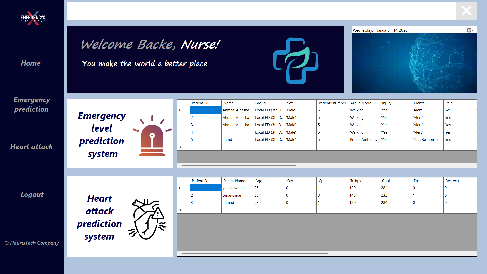
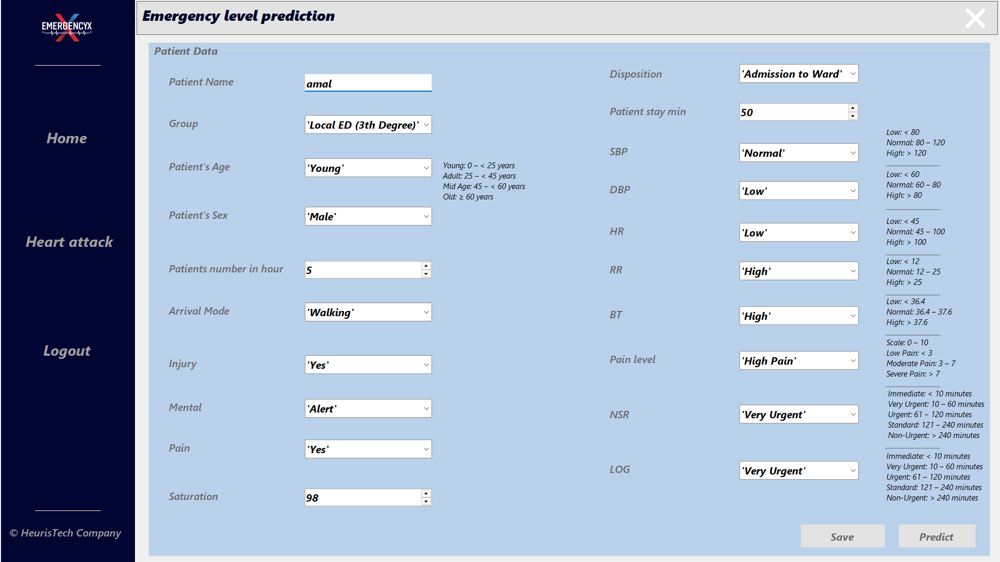
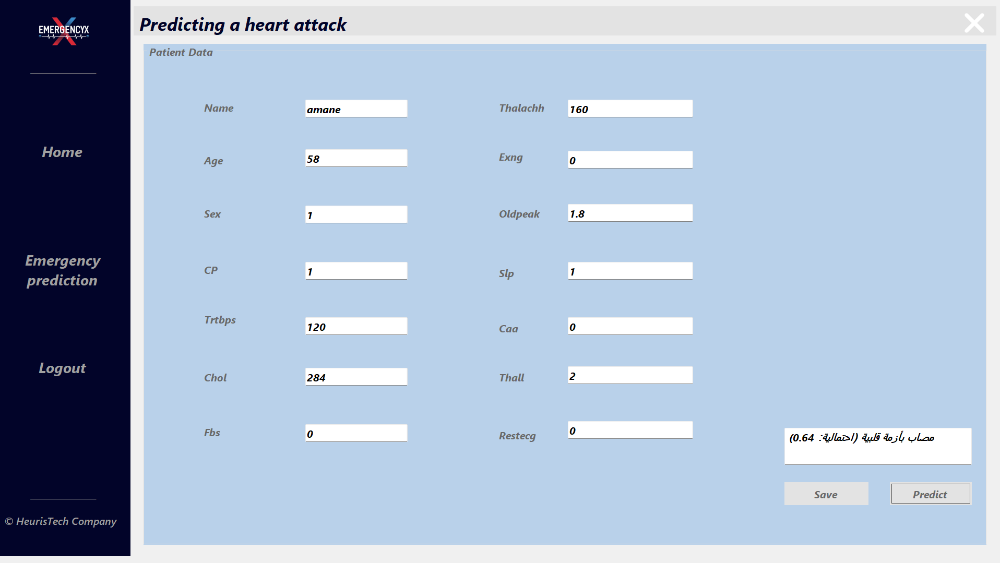

<div align="center">


# 🚨 EmergencyX

### AI-Powered Emergency Triage & heart attack Prediction System

[](https://www.microsoft.com/windows)
[](https://docs.microsoft.com/en-us/dotnet/csharp/)
[](https://dotnet.microsoft.com/)
[](https://dotnet.microsoft.com/apps/machinelearning-ai/ml-dotnet)
[](LICENSE)
[]()

> **EmergencyX** is an intelligent desktop application that leverages Machine Learning to revolutionize patient triage in emergency departments — predicting emergency severity levels and cardiac arrest risk in real time.

</div>

---

## 📋 Table of Contents

- [Overview](#-overview)
- [Key Features](#-key-features)
- [System Architecture](#-system-architecture)
- [Modules](#-modules)
- [Tech Stack](#-tech-stack)
- [Installation](#-installation)
- [How to Use](#-how-to-use)
- [ML Model Details](#-ml-model-details)
- [Project Structure](#-project-structure)
- [Screenshots](#-screenshots)
- [Contributing](#-contributing)
- [Author](#-author)

---

## 🌟 Overview

**EmergencyX** addresses one of the most critical challenges in emergency medicine — **speed and accuracy of triage**. Every second counts in an emergency, and misclassifying a patient's severity can be fatal.

By combining a modern Windows desktop UI with a trained Machine Learning backend, EmergencyX empowers medical staff to:

- **Instantly assess** emergency severity for incoming patients
- **Predict cardiac arrest risk** based on vital signs and clinical data
- **Prioritize patients** with confidence backed by data-driven AI

This project demonstrates the real-world integration of **C# desktop development** with **ML-based predictive modeling**.

---

## ✨ Key Features

| Feature | Description |
|---|---|
| 🏥 **Smart Triage** | Predicts emergency level (1–5 scale) based on patient vitals & symptoms |
| ❤️ **Cardiac Risk Prediction** | Detects risk of cardiac crisis using clinical indicators |
| 🤖 **ML Integration** | C# frontend communicates with trained ML model for real-time inference |
| 🖥️ **Desktop Application** | Native Windows app — fast, offline-capable, no browser needed |
| 📊 **Instant Results** | Predictions displayed within milliseconds of data entry |
| 🎯 **Dual Module System** | Two independent prediction modules in one unified interface |

---

## 🏗️ System Architecture

```
┌─────────────────────────────────────────────────────────────┐
│                    EmergencyX Desktop App                    │
│                        (C# / .NET)                           │
│                                                             │
│   ┌─────────────────────┐   ┌─────────────────────────┐    │
│   │   Module 1          │   │   Module 2              │    │
│   │   Emergency Triage  │   │   Cardiac Crisis        │    │
│   │   (Patient Input)   │   │   Prediction            │    │
│   └────────┬────────────┘   └────────────┬────────────┘    │
│            │                             │                  │
│            └──────────┬──────────────────┘                  │
│                       │                                     │
│              ┌────────▼────────┐                            │
│              │  ML Bridge      │                            │
│              │  (API / .NET)   │                            │
│              └────────┬────────┘                            │
└───────────────────────┼─────────────────────────────────────┘
                        │
          ┌─────────────▼──────────────┐
          │     ML Model Backend        │
          │  (ML.NET / Python / ONNX)   │
          │                            │
          │  ┌──────────┐ ┌──────────┐ │
          │  │ Triage   │ │ Cardiac  │ │
          │  │ Model    │ │ Model    │ │
          │  └──────────┘ └──────────┘ │
          └────────────────────────────┘
```

---

## 📦 Modules

### 🏥 Module 1 — Emergency Triage Prediction

The triage module accepts patient data and classifies the emergency level using a trained classification model.

**Input Parameters:**
- Age, Gender
- Chief complaint / Symptoms
- Vital signs (Heart Rate, Blood Pressure, O₂ Saturation, Temperature, Respiratory Rate)
- Consciousness level (GCS)
- Pain score (0–10)

**Output:**
- Emergency Level: `Level 1 (Resuscitation)` → `Level 5 (Non-Urgent)`
- Confidence score (%)
- Recommended action

---

### ❤️ Module 2 — Cardiac Crisis Prediction

The cardiac module analyzes clinical indicators to assess the risk of an acute cardiac event.

**Input Parameters:**
- Age, Gender, BMI
- Chest pain type & duration
- ECG findings
- Cardiac biomarkers (Troponin, CK-MB)
- Blood pressure, Cholesterol
- History of diabetes, hypertension, smoking

**Output:**
- Risk Level: `Low` / `Moderate` / `High` / `Critical`
- Probability score (%)
- Alert flag for immediate intervention

---

## 🛠️ Tech Stack

```
Frontend (Desktop UI)
├── Language       : C# (.NET 6 / .NET Framework)
├── UI Framework   : Windows Forms / WPF
└── IDE            : Visual Studio 2022

Machine Learning Backend
├── ML Framework   : ML.NET  ──or──  Python (scikit-learn / XGBoost)
├── Model Format   : .ZIP (ML.NET)  ──or──  .pkl / .onnx (Python)
├── Integration    : REST API (Flask)  ──or──  Direct ML.NET call
└── Training Data  : Emergency & Cardiac clinical datasets

Communication Layer
├── If Python ML   : HTTP REST API (localhost Flask server)
└── If ML.NET      : Direct in-process model loading
```

---

## ⚙️ Installation

### Prerequisites

- Windows 10 / 11 (64-bit)
- [.NET 6.0 Runtime](https://dotnet.microsoft.com/download) or higher
- Python 3.8+ *(only if using Python ML backend)*
- Visual Studio 2022 *(for development)*

### Clone the Repository

```bash
git clone https://github.com/YOUR_USERNAME/EmergencyX.git
cd EmergencyX
```

### Setup — C# Application

```bash
# Open solution in Visual Studio
start EmergencyX.sln

# Or build via CLI
dotnet restore
dotnet build
dotnet run
```

### Setup — Python ML Backend *(if applicable)*

```bash
cd MLBackend
pip install -r requirements.txt
python app.py
```

> The Flask server will start on `http://localhost:5000` and the C# app will connect automatically.

---

## 🚀 How to Use

**1. Launch the Application**
> Run `EmergencyX.exe` from the `bin/Release` folder or press `F5` in Visual Studio.

**2. Select a Module**
> Choose between `Emergency Triage` or `Cardiac Crisis Prediction` from the main dashboard.

**3. Enter Patient Data**
> Fill in the patient's clinical information in the structured form.

**4. Run Prediction**
> Click **"Analyze"** — the ML model processes the input and returns results instantly.

**5. Review Results**
> View the predicted severity level, confidence score, and recommended clinical action.

---

## 🤖 ML Model Details

| Property | Triage Model | Cardiac Model |
|---|---|---|
| **Type** | Multi-class Classification | Binary / Multi-class Classification |
| **Algorithm** | Random Forest / XGBoost | Logistic Regression / Neural Net |
| **Output Classes** | 5 Emergency Levels | 4 Risk Levels |
| **Input Features** | ~10 clinical features | ~12 clinical features |
| **Model Format** | `.zip` (ML.NET) / `.pkl` | `.zip` (ML.NET) / `.pkl` |

---

## 📁 Project Structure

```
EmergencyX/
│
├── EmergencyX/                   # Main C# Application
│   ├── Forms/
│   │   ├── MainDashboard.cs      # Main window
│   │   ├── TriageForm.cs         # Module 1 UI
│   │   └── CardiacForm.cs        # Module 2 UI
│   ├── Models/
│   │   ├── PatientData.cs        # Patient data model
│   │   └── PredictionResult.cs   # Result model
│   ├── Services/
│   │   ├── MLService.cs          # ML model communication
│   │   └── ApiService.cs         # REST API client (if Python)
│   └── EmergencyX.csproj
│
├── MLBackend/                    # Python ML Backend (optional)
│   ├── models/
│   │   ├── triage_model.pkl
│   │   └── cardiac_model.pkl
│   ├── app.py                    # Flask API server
│   ├── train_triage.py           # Model training script
│   ├── train_cardiac.py          # Model training script
│   └── requirements.txt
│
├── MLModels/                     # ML.NET Models (alternative)
│   ├── TriageModel.zip
│   └── CardiacModel.zip
│
├── Screenshots/                  # App screenshots
├── README.md
├── .gitignore
└── LICENSE
```

---

## 📸 Screenshots


| Dashboard | Triage Module | Cardiac Module |
|:---------:|:-------------:|:--------------:|
|  |  |  |

---

## 📄 .gitignore 

```gitignore
# Visual Studio
.vs/
bin/
obj/
*.user
*.suo

# Python
__pycache__/
*.pyc
*.pyo
.env
venv/
*.pkl         # optional: ignore trained models if large

# ML.NET models (if large, use Git LFS instead)
# *.zip

# OS
.DS_Store
Thumbs.db
*.log
```

---

## 🤝 Contributing

Contributions, issues and feature requests are welcome!

1. Fork the repository
2. Create your feature branch: `git checkout -b feature/AmazingFeature`
3. Commit your changes: `git commit -m 'Add AmazingFeature'`
4. Push to the branch: `git push origin feature/AmazingFeature`
5. Open a Pull Request

---

## 👤 Author

Ahmad Albasha

[](https://github.com/ahmad-albasha)
[](https://linkedin.com/in/ahmad-a-9a0373123)
[](mailto:ahmad-albasha09@hotmail.com)

---

## 📜 License

This project is licensed under the **MIT License** — see the [LICENSE](LICENSE) file for details.

---

<div align="center">

**⭐ If you find this project useful, please consider giving it a star!**

*Built with ❤️ to save lives through technology*

</div>
